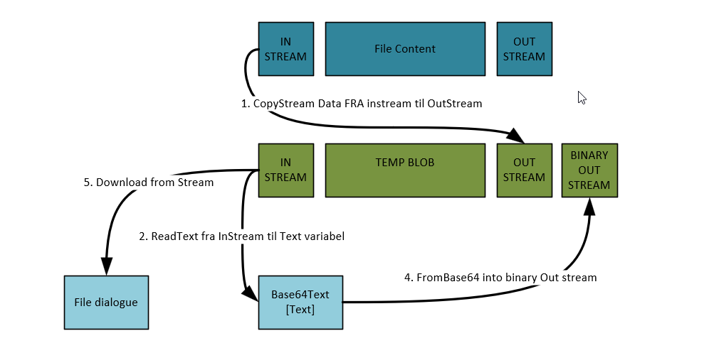

# Blob Across Companies

A Business Central extension that enables file storage across companies using blob fields.
It primarily serves to help better understand the misnomer that InStream and Outstream is in BC Blob management


## Features

- Store files in a shared table accessible across all companies
- Upload any file type using the built-in file picker
- Download stored files
- View file metadata (name, extension, upload date)
- Data is stored in the database using blob fields
- Accessible through the "Blob Storage List" page

## Technical Details

- Table: "Blob Storage" (50100)
  - Configured with `DataPerCompany = false` for cross-company access
  - Uses blob field for file content storage
  - Tracks metadata like filename, extension, and creation date

- Page: "Blob Storage List" (50100)
  - List page with upload/download capabilities
  - Available through role center search
  - Displays file metadata in an easy-to-read format

## Usage

1. Open "Blob Storage List" page
2. To upload:
   - Click "Upload" action
   - Select file from your device
   - File will be stored with metadata
3. To download:
   - Select a file from the list
   - Click "Download" action
   - Choose save location on your device

  ## New Feature: Base64 Blob Content Button

  ### Overview

  A new button has been added to the "Blob Storage List" page that allows users to view the base64 encoded content of the stored files.

  ### How to Use

  1. Open "Blob Storage List" page
  2. To view base64 content:
    - Select a file from the list
    - Click "View Base64 Content" action
    - A dialog will display the base64 encoded content of the selected file

  ### Benefits

  - Easily copy the base64 encoded content for use in other applications
  - Quick access to file content without downloading

  ### Technical Details

  - Action: "View Base64 Content"
    - Added to the "Blob Storage List" page
    - Displays a dialog with the base64 encoded content of the selected file
  - Utilizes AL code to convert blob content to base64 string

  ### Example

  ```al
  trigger OnAction()
  var
     Base64Content: Text;
  begin
     if Rec.BlobField.HasValue then begin
        Base64Content := Convert.ToBase64String(Rec.BlobField);
        Message('Base64 Content: %1', Base64Content);
     end else
        Error('No content available.');
  end;
  ```
## Security

- File content is stored with `CustomerContent` data classification
- System metadata uses `SystemMetadata` classification
- All operations are tracked with standard BC logging
